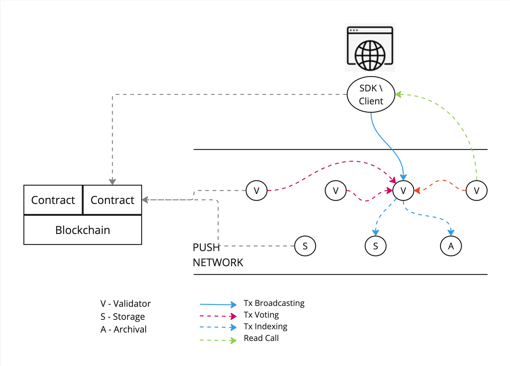
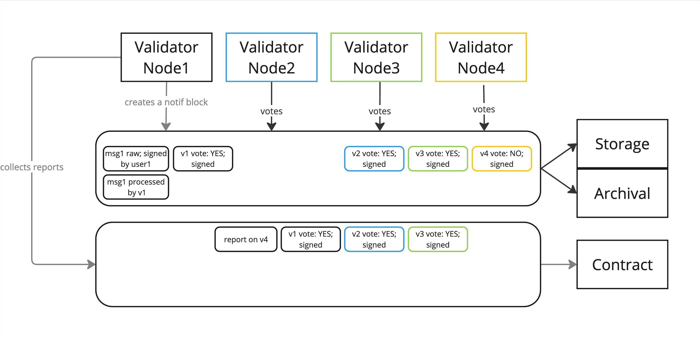

<h1 align="center">
    <a href="https://push.org/#gh-light-mode-only">
    
    </a>
    <a href="https://push.org/#gh-dark-mode-only">
    
    </a>
</h1>

<p align="center">
  <i align="center">Push Protocol is a web3 communication network, enabling cross-chain notifications, messaging and much more for dapps, wallets, and services.🚀</i>
</p>

<h4 align="center">

  <a href="https://discord.com/invite/pushprotocol">
    
  </a>
  <a href="https://twitter.com/pushprotocol">
    
  </a>
  <a href="https://www.youtube.com/@pushprotocol">
    
  </a>
</h4>

<p align="center">
    
</p>

# Push Validator Node

Push Validator Node is a part of Push's Proof of Stake (PoS) chain and is responsible for ensuring the integrity and authenticity of transactions by validating them.

## Table of Contents

- [Overview](#overview)
- [Architecture](#architecture)
- [Installation](#installation)
- [Testing](#testing)
- [Contributing](#contributing)
- [License](#license)
- [Docker](#docker)

## Overview
Push Validator Nodes are responsible for validating txs that are generated on Push Network. These types of nodes ensure validity of a tx that is generated by validating the signer of the tx. They also ensure that either the wallet that generates the tx or a delegate has enough fees to cover the tx.

## Architecture

### Staking Requirement
To operate a validator node, participants must stake a certain amount of tokens. This staking process serves as a security deposit, ensuring that validators act in the network's best interest.

### Validation Process
1. When a transaction is generated, the Push Network’s SDK / client pings a random Validator `Vx` which returns another random validator `Vy` and an attestation token.
2. Client sends the transaction to `Vy` along with the attestation token. ( Attestation token is a time based token that is generated by `Vx` to provide ability to client to send a transaction to  `Vy` )
3. `Vy` validates the transaction on basis od several parameters like ( These are just for reference, actual parameters may vary ):
    - Is the transaction signed by the correct signer?
    - Does the signer have enough fees to cover the transaction?
    - Is the transaction valid?
    - Is the transaction within the network's rules?
4. Once the transaction is validated, `Vy` processes this transaction to be attached to a block.
5. The block is attested by N number of validators and is marked as approved or rejected based on the majority vote.

### Quorum
A quorum is the minimum number of validator approvals required for a block to be verified. It is decided by the smart contract `validator.sol` and can be changed by the network's governance process.

### Storage and Indexing
After the block is validated, it is stored in the queue storage of the validator node. Blocks are picked up from this queue by storage nodes who store and index them.



### Security Mechanisms
1. Slashing:
If a validator node is found to be acting maliciously—such as approving fraudulent notifications—the network can penalize the validator by slashing a portion of their staked tokens. This penalty deters malicious activity and ensures that validators have a financial incentive to act honestly.
2. Random Selection:
The random selection of validators for both the initial verification and subsequent attestation adds an extra layer of security. It prevents collusion among validators and ensures that the validation process remains fair and unbiased.
  


## Installation

⚠️ **Warning: Work In Progress** ⚠️

This project is currently a work in progress. Please be aware that things might break, and the installation process might change as we improve and dockerize it completely for public running of the node. Proceed with caution and check back frequently for updates.  

## Installation Steps

### Prerequisites

- [Node.js](https://nodejs.org/) (>= 16)
- [Docker](https://www.docker.com/)
- [Yarn](https://yarnpkg.com/)

### Setup `do.sh` Script
The `do.sh` script is included inside the **`zips`** folder. It provides shortcuts for running various commands, including publishing a default test key and executing Hardhat with arguments. Ensure you review the code before executing any commands.

- **Setting up `do.sh`**
	 - Place `do.sh` in a directory accessible by your environment (e.g., your home directory).
	 - Grant execute privileges to the script:
		 ```bash
		 chmod +x do.sh
		 ```

- **Running `do.sh`**
	There are multiple ways to execute the `do.sh` script:
	 - **Full Path Execution:**
		 Navigate to the project directory:
		 ```bash
		 cd /path/to/push-storage-node-project-dir /home/user/do.sh command1 command2 command3
		 ```
	 - **Add `do.sh` to Your Path:**
		 Follow the instructions in [this Apple discussion](https://discussions.apple.com/thread/254226896?sortBy=best) to add `do.sh` to your system path. Then, navigate to the project directory:
	     ```bash
	     cd /path/to/push-storage-node-project-dir 
	     ./do.sh command1 command2 command3
	     ```
	 - **Create an Alias for `do.sh` (Recommended):**
	 Add an alias to your shell configuration:
		 ```bash
		 # Open .zshrc file 
		 nano $HOME/.zshrc 
		 # Add this line to the file 
		 alias do='/Users/your-username/Documents/projects/do.sh' 
		 # Save and close the file
		 ```
		Restart your shell to apply changes. Now, you can use `do` to run commands:
		```bash
		cd /path/to/push-storage-node-project-dir 
		do command1 command2 command3
		```

### Running the Node


1.  Clone the repository:

    ```bash
    git clone https://github.com/push-protocol/push-vnode.git
    cd push-vnode
    ```

2.  Install dependencies:

    ```bash
    yarn install
    ```

2. Configure docker directories:
To set up the validator nodes, you'll need to configure specific directories for each node. This setup ensures that each node runs independently with its own environment and key files.

    - Download and Unpack Docker Directory:
    Get the `docker-dir-for-vnodes.zip` file from the `zips` folder and extract it into your project's root directory. After extraction, you'll find a `/docker` directory containing subdirectories for each node: `/docker/01, /docker/02, and /docker/03`.
Each node directory (e.g., docker/01, docker/02, docker/03) contains the necessary configuration files and scripts to run the node.

    - Key Files within Each Node Directory:
**.env**: This file contains environment-specific properties, such as database credentials, node identifiers, and other configuration settings that the node requires to operate.
**validator_eth_key.json**: This file holds the Ethereum key for the validator node. The key is password-encrypted to ensure security. This key is essential for the node to sign and validate transactions on the network.
**History Fetcher Configuration:** For demonstration purposes, the history fetcher is turned off. This means that the nodes will not retrieve or process historical data, which simplifies the setup and reduces resource consumption during testing.


4.  Start the docker container:

    ```bash
    docker-compose up
    ```

    > **Note:** It is expected that after this command you would have the following containers running: **postgres, redis, ipfs**

5. Database Setup:
For the nodes to function correctly, you need to set up three separate databases, one for each node. These databases will store the data related to each validator node.

    <!-- -  Access the MySQL command-line interface by running the following command in your terminal:
   ```bash
   mysql -u root -p PASSWORD=pass
   ```
    -->

    - Create each of the databases by running the following commands:
        ```bash
        CREATE DATABASE vnode1 CHARACTER SET utf8 COLLATE utf8_general_ci;
        CREATE DATABASE vnode2 CHARACTER SET utf8 COLLATE utf8_general_ci;
        CREATE DATABASE vnode3 CHARACTER SET utf8 COLLATE utf8_general_ci;
        ```

6.  Run the nodes in separate terminals:
    ```bash
    # Run Validator Node 1
    do debug.v1

    # Run Validator Node 2
    do debug.v2

    # Run Validator Node 3
    do debug.v3
    ```
7. Mocking Data ( Optional ) 

    After starting the nodes, you can add mock data to each database to simulate channel subscriptions. This helps in syncing with the local EVM for demonstration purposes.
    > **Note:** Skip this if you are not using the local EVM. For production, this data will be synced up by HistoryFetcher on Sepolia testnet.
    
    ```shell
    INSERT INTO channels (channel, ipfshash, name, info, url, icon, processed, attempts, alias_address, alias_blockchain_id, is_alias_verified, blocked, alias_verification_event, activation_status, verified_status, subgraph_details, subgraph_attempts, counter, timestamp, channel_settings)
    VALUES ('eip155:11155111:0xD8634C39BBFd4033c0d3289C4515275102423681', 'QmTX8zZjzuKpiLZmn4ShNzyKDakNdbBQfwi449TBw7wgoK', 'testing goerli', 'Testing', 'https://dev.push.org/', 'https://gateway.ipfs.io/ipfs/bafybeidkt3qrlcplntabfazs7nnzlxdzu36mmieth2ocyphm2kp4sh333a/QmTX8zZjzuKpiLZmn4ShNzyKDakNdbBQfwi449TBw7wgoK', 1, 0, 'NULL', 'NULL', 0, 0, null, 1, 0, null, 0, null, '2023-08-11 13:45:05', null);

    INSERT INTO subscribers (is_currently_subscribed, channel, alias, subscriber, signature, timestamp, sub_timestamp, unsub_timestamp, user_settings) 
    VALUES (1, 'eip155:11155111:0xD8634C39BBFd4033c0d3289C4515275102423681', null, 'eip155:0x5ac9E6205eACA2bBbA6eF716FD9AabD76326EEee', 'eip155:11155111:0xba3f4df977fc09614e86c84ab4857ce9b113d52dde258aedfa263fc29018f611', '2022-10-04 08:10:12', '2022-10-04 08:10:12', null, 'null');

    INSERT INTO subscribers (is_currently_subscribed, channel, alias, subscriber, signature, timestamp, sub_timestamp, unsub_timestamp, user_settings) 
    VALUES (1, 'eip155:11155111:0xD8634C39BBFd4033c0d3289C4515275102423681', null, 'eip155:0x69e666767Ba3a661369e1e2F572EdE7ADC926029', 'eip155:11155111:0xc5147c36467f489c212460e01dfd1ede1d853d67d17c042e994100b89a0d5a9d', '2022-10-20 12:27:48', '2022-10-20 12:27:48', null, 'null');

    INSERT INTO subscribers (is_currently_subscribed, channel, alias, subscriber, signature, timestamp, sub_timestamp, unsub_timestamp, user_settings) 
    VALUES (1, 'eip155:11155111:0xD8634C39BBFd4033c0d3289C4515275102423681', null, 'eip155:0xD8634C39BBFd4033c0d3289C4515275102423681', 'eip155:11155111:0xba3f4df977fc09614e86c84ab4857ce9b113d52dde258aedfa263fc29018f611', '2022-10-04 08:10:12', '2022-10-04 08:10:12', null, 'null');
    ```


## Testing

### Testing the node with CURL

1. Get a validator Token
**Request:**
    ```curl
     curl --location 'http://localhost:4001/apis/v1/messaging/validatorToken'
    ```
    **Response:**
    ```json
    {"validatorToken":"eyJub2RlcyI6W3sibm9kZUlkIjoiMHhmREFFYWY3YWZDRmJiNGU0ZDE2REM2NmJEMjAzOWZkNjAwNENGY2U4IiwidHNNaWxsaXMiOjE2OTUxODg4ODAwMjQsInJhbmRvbUhleCI6ImE1MDBhYmE5MjFmM2FiOGIwYjdiODY2Y2NmZDFkZjk2ZDdjNzg2MGIiLCJwaW5nUmVzdWx0cyI6W3sibm9kZUlkIjoiMHg4ZTEyZEUxMkMzNWVBQmYzNWI1NmIwNEU1M0M0RTQ2OGU0NjcyN0U4IiwidHNNaWxsaXMiOjE2OTUxODg4ODAwMTYsInN0YXR1cyI6MX0seyJub2RlSWQiOiIweDk4RjlEOTEwQWVmOUIzQjlBNDUxMzdhZjFDQTc2NzVlRDkwYTUzNTUiLCJ0c01pbGxpcyI6MTY5NTE4ODg4MDAxNSwic3RhdHVzIjoxfV0sInNpZ25hdHVyZSI6IjB4N2Q2YzJkOTczMzg0ODIwNGFiYmNmZjcwZjYwYzJkZDg5MDFlZDJhOWUyODg1NWQ3YTdkZjgwYzI1NzBjZTQ3NzM0NThhMzBjNDBkM2FkYjU4NmIzYzNmYmJkYjhmZmQyYmQwYTIzMjhjNDRjMjBjNWM3OTQ3M2RmZjA2Y2JlZmIxYyJ9LHsibm9kZUlkIjoiMHg5OEY5RDkxMEFlZjlCM0I5QTQ1MTM3YWYxQ0E3Njc1ZUQ5MGE1MzU1IiwidHNNaWxsaXMiOjE2OTUxODg4ODAwMjMsInJhbmRvbUhleCI6IjE4ZjlhMTg5NDNmYzMyY2M0MDdkZTYwZDgzMmNjNDk2NjAxMjg2ZTciLCJwaW5nUmVzdWx0cyI6W3sibm9kZUlkIjoiMHg4ZTEyZEUxMkMzNWVBQmYzNWI1NmIwNEU1M0M0RTQ2OGU0NjcyN0U4IiwidHNNaWxsaXMiOjE2OTUxODg4NTAwMzgsInN0YXR1cyI6MX0seyJub2RlSWQiOiIweGZEQUVhZjdhZkNGYmI0ZTRkMTZEQzY2YkQyMDM5ZmQ2MDA0Q0ZjZTgiLCJ0c01pbGxpcyI6MTY5NTE4ODg1MDAzNiwic3RhdHVzIjoxfV0sInNpZ25hdHVyZSI6IjB4ZDFjNmM5NjUwM2I4YTk5YzgxY2EwZmJkODE3Y2NlNmY2ODU1MTVkMWQ4NDA2YmE5ZjgzNTZkZmU1NTc3YTFlNzAwMjc0MDIxMTFjZTNkNjkyMDQ0Y2I2NDIzMzEzZWY0NzkzM2RmYmNkYWY0ZWNmNzhlN2YzOTk0ZjJkZGQ1NjAxYiJ9LHsibm9kZUlkIjoiMHg4ZTEyZEUxMkMzNWVBQmYzNWI1NmIwNEU1M0M0RTQ2OGU0NjcyN0U4IiwidHNNaWxsaXMiOjE2OTUxODg4ODAwMzAsInJhbmRvbUhleCI6ImZmNTQxNWI1ZDFkNzM1MWRlMTI5ZjU1M2NjMzRiNDQ2MTRhODdjMjIiLCJwaW5nUmVzdWx0cyI6W3sibm9kZUlkIjoiMHhmREFFYWY3YWZDRmJiNGU0ZDE2REM2NmJEMjAzOWZkNjAwNENGY2U4IiwidHNNaWxsaXMiOjE2OTUxODg4ODAwMTksInN0YXR1cyI6MX0seyJub2RlSWQiOiIweDk4RjlEOTEwQWVmOUIzQjlBNDUxMzdhZjFDQTc2NzVlRDkwYTUzNTUiLCJ0c01pbGxpcyI6MTY5NTE4ODg4MDAxOCwic3RhdHVzIjoxfV0sInNpZ25hdHVyZSI6IjB4NzIyYTIwOTNjOTM5OTkzYzIxYjhjYzEzNGY3MDc1NGRiYjk1YjExODZlODk2ZmY2YjE0OWMyODMwYmUwMDIzMTI5ZGY2ZTkxYjFlZjMwYWE0Zjc5MmQ5NTAxYjgwN2RlZGY4YjMyNDU4ZDZkZTE4MmMyNzNiYzI0N2Y0M2I5ZTkxYiJ9XX0=","validatorUrl":"http://localhost:4001"}%  

    ```
<!-- 2. Send Notification with Pre-existing API Token
    **Request:**
    ```curl
    curl --location 'http://localhost:4001/apis/v1/messaging/addBlocking' \
    --header 'Content-Type: application/json' \
    --data '{
	"verificationProof": "eip712v2:0x37ba76d10dceff2c4675d186a17b0e0ffe6020eef42ba170a2436192051996ad3daf835bb660bbad587f44a4e153bd9285fe0a166b35abd978453942f0b325ec1c::uid::1675756031",
	"sender": "eip155:1155111:0xD8634C39BBFd4033c0d3289C4515275102423681",
	"recipient": "eip155:1155111:0xD8634C39BBFd4033c0d3289C4515275102423681",
	"identity": "0+1+Hey From Push Nodes+Dropping test directly on push nodes ",
	"source": "ETH_TEST_SEPOLIA",
    "validatorToken": "eyJub2RlcyI6W3sibm9kZUlkIjoiMHhmREFFYWY3YWZDRmJiNGU0ZDE2REM2NmJEMjAzOWZkNjAwNENGY2U4IiwidHNNaWxsaXMiOjE3MDM5Mjk1NjAwMjcsInJhbmRvbUhleCI6IjEwYjFlNzJlOWMxYzU0MGM3YmNmMmRjZjMyOTgwZjU0MTI0MGJiNDYiLCJwaW5nUmVzdWx0cyI6W3sibm9kZUlkIjoiMHg4ZTEyZEUxMkMzNWVBQmYzNWI1NmIwNEU1M0M0RTQ2OGU0NjcyN0U4IiwidHNNaWxsaXMiOjE3MDM5Mjk1NjAwMTYsInN0YXR1cyI6MX0seyJub2RlSWQiOiIweDk4RjlEOTEwQWVmOUIzQjlBNDUxMzdhZjFDQTc2NzVlRDkwYTUzNTUiLCJ0c01pbGxpcyI6MTcwMzkyOTU2MDAyNSwic3RhdHVzIjoxfV0sInNpZ25hdHVyZSI6IjB4OTE5YzIzOGYzNGIzMGFjYWRkMTdkMzU1ZmE2YzIxOGNkMmI4OWY4MjkyYzVhMTRjNjdhOWVkYTNmMDEzYzU1MjFjNjQ0NDkxMzE0ODViMjViYmRlOWFiM2IxZjlmNWU5ZmY2ZGQ4NTM3MjM5Mzk5YTFhOThjNjVmMGRjNTJiNDExYyJ9LHsibm9kZUlkIjoiMHg5OEY5RDkxMEFlZjlCM0I5QTQ1MTM3YWYxQ0E3Njc1ZUQ5MGE1MzU1IiwidHNNaWxsaXMiOjE3MDM5Mjk1NjAwMjgsInJhbmRvbUhleCI6IjM4MjY4ZjUyZGQyODU1Zjk3Y2FiZGViYTFiZmIwM2U2NDQ0YjA4NzciLCJwaW5nUmVzdWx0cyI6W3sibm9kZUlkIjoiMHg4ZTEyZEUxMkMzNWVBQmYzNWI1NmIwNEU1M0M0RTQ2OGU0NjcyN0U4IiwidHNNaWxsaXMiOjE3MDM5Mjk1NjAwMTksInN0YXR1cyI6MX0seyJub2RlSWQiOiIweGZEQUVhZjdhZkNGYmI0ZTRkMTZEQzY2YkQyMDM5ZmQ2MDA0Q0ZjZTgiLCJ0c01pbGxpcyI6MTcwMzkyOTU2MDAyMywic3RhdHVzIjoxfV0sInNpZ25hdHVyZSI6IjB4NmI1NDE2M2VjN2M3ODRiYzQ1Y2E2Y2Y1MTE1ZWQwYWZkNTlmM2IxMzJmNTc4OGQ1YzFhOTcyODgzZmZjM2JiOTY5MjJiNWNkMmM2ZDJhMjkxYjRiMzVjYTliMWM2MTA0N2IwYjNkNWQ4OTdiZTE3ZmNjZWRlOTNjYmUwY2Q1MTAxYyJ9LHsibm9kZUlkIjoiMHg4ZTEyZEUxMkMzNWVBQmYzNWI1NmIwNEU1M0M0RTQ2OGU0NjcyN0U4IiwidHNNaWxsaXMiOjE3MDM5Mjk1NjAwMjksInJhbmRvbUhleCI6IjVkMzAxNTU5YjgyM2FjYmQwNGM0YWRiODU4MmIxYWI3OWQxMWI0MTIiLCJwaW5nUmVzdWx0cyI6W3sibm9kZUlkIjoiMHhmREFFYWY3YWZDRmJiNGU0ZDE2REM2NmJEMjAzOWZkNjAwNENGY2U4IiwidHNNaWxsaXMiOjE3MDM5Mjk1NjAwMTUsInN0YXR1cyI6MX0seyJub2RlSWQiOiIweDk4RjlEOTEwQWVmOUIzQjlBNDUxMzdhZjFDQTc2NzVlRDkwYTUzNTUiLCJ0c01pbGxpcyI6MTcwMzkyOTU2MDAyOCwic3RhdHVzIjoxfV0sInNpZ25hdHVyZSI6IjB4NmZhMzZiZDE4MDNkZGVhYWMzODRmN2VhNDUzY2FhZDNjZWJlNTJmN2E3ZTRkZTY1YmY2ZTNjZTY3OGQxMTM3ODNkOGY1MGNhNTIxMzgzNzA2ODNlODYzN2MwYWJkOGY2ZjE1ZGIwZjVjOTdmNmVhMjE0ZmFkNzQ2Y2M5OWViOWIxYiJ9XX0="
    }'
    ``` -->
    
2. Show subscribers (Works for any VNode)
**Request:**
    ```curl
    curl --location 'http://localhost:4001/apis/v1/messaging/settings/eip155:11155111:0xD8634C39BBFd4033c0d3289C4515275102423681/ETH_TEST_SEPOLIA'
    ```


## Contributing

We welcome contributions from the community! To contribute, please follow these steps:

1. Fork the repository.
2. Create a new branch (`git checkout -b feature/your-feature-name`).
3. Make your changes and commit them (`git commit -m 'Add some feature'`).
4. Push to the branch (`git push origin feature/your-feature-name`).
5. Open a pull request.

Please ensure your code adheres to our coding standards and includes appropriate tests.

## License

This project is licensed under the MIT License. See the [LICENSE](LICENSE) file for details.

## Protobuf modifications
For every edit to /proto/push/block.proto.ts
Please do the following

- check that protobuf is installed

```shell
protoc --version
### libprotoc 3.20.3

## if missing (for mac)
brew install protobuf@3
```

- regenerate files
```shell
yarn build:proto
```

- commit new files

## generate protobuf
yarn add ts-protoc-gen
yarn build:proto

## Docker 
**FOR local testing**

Assumptions:
- default dir is /Users/w/chain where all push git repos are located (you can use any)
  - /Users/w/chain/push-node-smart-contracts
  - /Users/w/chain/push-vnode
  - /Users/w/chain/push-snode
  - /Users/w/chain/push-anode
- docker and docker-compose are installed
- docker desktop case: Allow full docker image access to /Users/w/chain in Preferences->Resources->File sharing
- recommended docker version could look like this (no specific version is needed; )
- naming conventions:
  - docker images: hardhat-main, validator-main, ...
  - docker containers: vnode1, vnode2, ...
  - docker dns: vnode1.local, redis.local, hardhat.local, ....
```shell
docker --version
Docker version 20.10.21, build baeda1f

docker compose version
Docker Compose version v2.13.0

python3 --version
Python 3.11.6
```

Setup docker images for smart-contracts & vnodes
```bash
## create docker network
docker network create push-shared-network
## prepare image for hardhat
cd /Users/w/chain/push-node-smart-contracts
docker build . -t hardhat-main
 
## prepare image for V (if needed)
cd /Users/w/chain/push-vnode
docker build . -t vnode-main

## prepare image for S (if needed)
cd /Users/w/chain/push-snode
docker build . -t snode-main

## prepare image for A (if needed)
cd /Users/w/chain/push-anode
docker build -t anode-main -f Dockerfile.light .
```

Run 


```bash
cd /Users/w/chain/push-vnode/docker

## edit .env if needed;  

## run evm (hardhat test vm)
docker compose -f evm.yml up -d

## run mysql + postgres + redis + phpmyadmin 
# generates db users/permissions applied ONLY once at startup
python3 db-prepare.py
# run dbs
docker compose -f db.yml up -d
## hints:
## read logs:                         db.yml logs -f
## re-create container (non-existing) db.yml up -d
## start (existing)                   db.yml start
## stop  (existing)                   db.yml stop
## delete container:                  db.yml down
## delete everything:                 ./cleanup.sh

## run vnode1 + vnode2 + vnode3 
docker compose -f v.yml up -d

## run snode1 + snode2
docker compose -f s.yml up -d

## run anode1
docker compose -f a.yml up -d

```

Check that all docker DNS is online (OPTIONAL)
```bash
docker exec redis bash -c " getent hosts redis.local "
docker exec redis bash -c " getent hosts mysql.local "
docker exec redis bash -c " getent hosts phpmyadmin.local "
docker exec redis bash -c " getent hosts hardhat.local "
docker exec redis bash -c " getent hosts vnode1.local "
docker exec redis bash -c " getent hosts vnode2.local "
docker exec redis bash -c " getent hosts vnode3.local "
```

Test vnodes: vnode1, vnode2, vnode3 are online and visible from the host machine
```shell
## 
curl --location 'http://localhost:4001/api/v1/rpc/' \
--header 'Content-Type: application/json' \
--data '{
    "jsonrpc": "2.0",
    "method": "push_listening",  
    "params": [],
    "id": 1
}'
echo ------------ 
curl --location 'http://localhost:4002/api/v1/rpc/' \
--header 'Content-Type: application/json' \
--data '{
    "jsonrpc": "2.0",
    "method": "push_listening",  
    "params": [],
    "id": 2
}'
echo ------------ 
curl --location 'http://localhost:4003/api/v1/rpc/' \
--header 'Content-Type: application/json' \
--data '{
    "jsonrpc": "2.0",
    "method": "push_listening",  
    "params": [],
    "id": 3
}'
echo ------------ 
```
Test vnodes: Smoke-test validator api
```shell
### 1 send a test transaction (DUMMY DATA) (INCLUDES API TOKEN)
curl --location 'http://localhost:4001/api/v1/rpc/' \
--header 'Content-Type: application/json' \
--data '{
    "jsonrpc": "2.0",
    "method": "push_sendTransaction",  
    "params": ["1208494e49545f4449441a336569703135353a313a30783335423834643638343844313634313531373763363444363435303436363362393938413661623422336569703135353a313a30783335423834643638343844313634313531373763363444363435303436363362393938413661623422346569703135353a39373a3078443836333443333942424664343033336330643332383943343531353237353130323432333638312a670a0f6469643a6578616d706c653a313233120e6d61737465725f7075625f6b6579220f646572697665645f7075625f6b657932330a177075736831303232326e333233326d7764656963656a331218737472696e6769666965645f656e637279707465645f706b321071d60eecc00f4cc8ac898784a7eeb98f3ab40b7b226e6f646573223a5b7b226e6f64654964223a22307838653132644531324333356541426633356235366230344535334334453436386534363732374538222c2274734d696c6c6973223a313732363134383637303032342c2272616e646f6d486578223a2262323637636131656661626366386264323063623763616336356330633534323865656664663338222c2270696e67526573756c7473223a5b7b226e6f64654964223a22307866444145616637616643466262346534643136444336366244323033396664363030344346636538222c2274734d696c6c6973223a313732363134383637303032302c22737461747573223a317d2c7b226e6f64654964223a22307839384639443931304165663942334239413435313337616631434137363735654439306135333535222c2274734d696c6c6973223a313732363134383637303031362c22737461747573223a317d5d2c227369676e6174757265223a22307834366331643237316663383637343435393138356132616265636637373736323961303133373066343366303766343965623431363235616565656631643033356431396664326164326437323232373162343166336536636231653735303338343730366162383336363437363837653539346362636462636632316165663162227d2c7b226e6f64654964223a22307839384639443931304165663942334239413435313337616631434137363735654439306135333535222c2274734d696c6c6973223a313732363134383637303032392c2272616e646f6d486578223a2263316662333961383232623964383261643264373437333230626165383634303634386632356137222c2270696e67526573756c7473223a5b7b226e6f64654964223a22307838653132644531324333356541426633356235366230344535334334453436386534363732374538222c2274734d696c6c6973223a313732363134383637303031372c22737461747573223a317d2c7b226e6f64654964223a22307866444145616637616643466262346534643136444336366244323033396664363030344346636538222c2274734d696c6c6973223a313732363134383637303032342c22737461747573223a317d5d2c227369676e6174757265223a22307866663737366563393736306235646134373238323130333862646631646363656162333130666531323030376262336634336636346236343535303264663466333733323234333066653333366535313661356336613734363038353465343033306235363334343633646338613064613135386131623063373861323630653162227d2c7b226e6f64654964223a22307866444145616637616643466262346534643136444336366244323033396664363030344346636538222c2274734d696c6c6973223a313732363134383637303033352c2272616e646f6d486578223a2262393331656334316233393763623164656234396536353764396437623739383764316361373530222c2270696e67526573756c7473223a5b7b226e6f64654964223a22307838653132644531324333356541426633356235366230344535334334453436386534363732374538222c2274734d696c6c6973223a313732363134383637303031352c22737461747573223a317d2c7b226e6f64654964223a22307839384639443931304165663942334239413435313337616631434137363735654439306135333535222c2274734d696c6c6973223a313732363134383637303032352c22737461747573223a317d5d2c227369676e6174757265223a22307837633964343832396336616161363535396465643833323433623665386438623665623333366439303932613261306466323533316463336364396532623335353735626462386261313134323263326663346262363737653064396365356266343464353466653538373266396530373661633339643530316237343934333163227d5d7d42412592af30c62ac73025e37826d60a250e7c4f44c3697d2868307255bcff52a4b61e9a3fa015761ebd89b3d9d1ce3e4a7ad4691c5259e56f8be2e79a486a1eb01b1b4a0130"],
    "id": 1
}'
echo ------------ 

### 2 read transaction queue size
curl --location 'http://localhost:4001/api/v1/rpc/' \
--header 'Content-Type: application/json' \
--data '{
    "jsonrpc": "2.0",
    "method": "push_readBlockQueueSize",  
    "params": [],
    "id": 1
}'

### 3 read transaction queue
curl --location 'http://localhost:4001/api/v1/rpc/' \
--header 'Content-Type: application/json' \
--data '{
    "jsonrpc": "2.0",
    "method": "push_readBlockQueue",  
    "params": ["0"],
    "id": 1
}'
```

Test vnodes: Smoke test api token
```sh
### 1 get api token
curl --location 'http://localhost:4001/api/v1/rpc/' \
--header 'Content-Type: application/json' \
--data '{
"jsonrpc": "2.0",
"method": "push_getApiToken",  
"params": [],
"id": 1
}'
echo ------------ 
```

Test anodes: Get blocks
```shell
curl --location 'http://localhost:5001/rpc' \
--header 'Content-Type: application/json' \
--data '{
    "jsonrpc": "2.0",
    "method": "RpcService.getBlocks",
    "params": {
        "startTime": 1724771470,
        "direction": "DESC",
        "showDetails": true,
        "pageSize": 10,
        "page": 1
    },
    "id": 1
}'
```