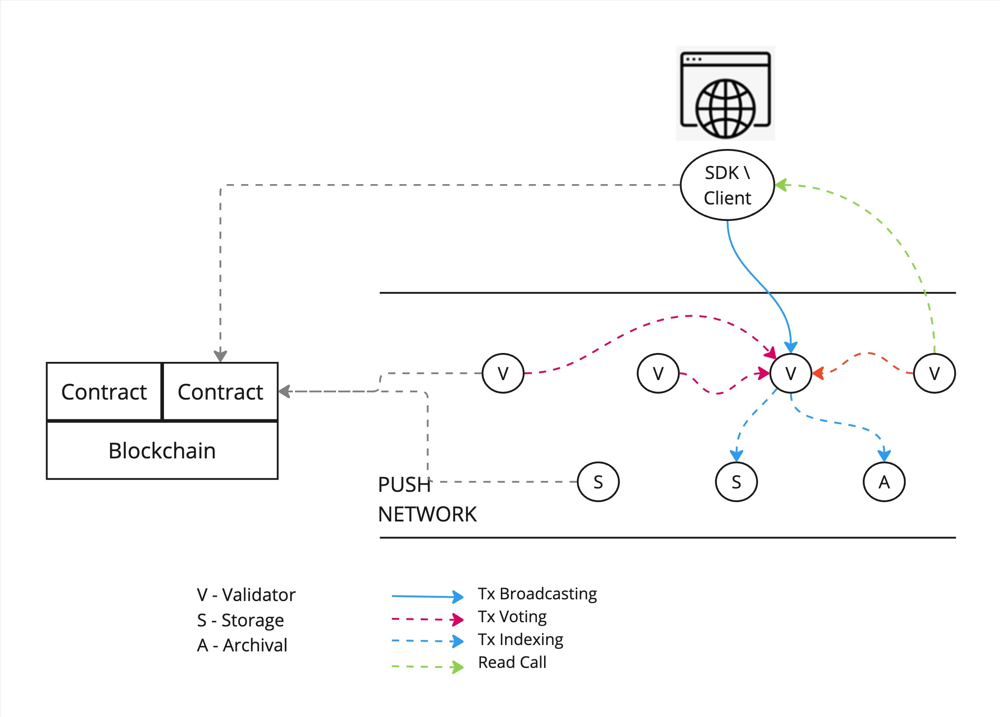
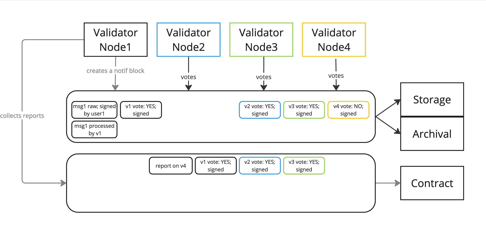

<h1 align="center">
    <a href="https://push.org/#gh-light-mode-only">
    
    </a>
    <a href="https://push.org/#gh-dark-mode-only">
    
    </a>
</h1>

<p align="center">
  <i align="center">Push Protocol is a web3 communication network, enabling cross-chain notifications, messaging and much more for dapps, wallets, and services.🚀</i>
</p>

<h4 align="center">

  <a href="https://discord.com/invite/pushprotocol">
    
  </a>
  <a href="https://twitter.com/pushprotocol">
    
  </a>
  <a href="https://www.youtube.com/@pushprotocol">
    
  </a>
</h4>

<p align="center">
    
</p>

# Push Validator Node

Push Validator Node is a part of Push's Proof of Stake (PoS) chain and is responsible for ensuring the integrity and authenticity of transactions by validating them.

## Table of Contents

- [Overview](#overview)
- [Architecture](#architecture)
- [Installation](#installation)
- [Testing](#testing)
- [Contributing](#contributing)
- [License](#license)
- [Docker](#Docker-env-setup)

## Overview
Push Validator Nodes are responsible for validating txs that are generated on Push Network. These types of nodes ensure validity of a tx that is generated by validating the signer of the tx. They also ensure that either the wallet that generates the tx or a delegate has enough fees to cover the tx.

## Architecture

### Staking Requirement
To operate a validator node, participants must stake a certain amount of tokens. This staking process serves as a security deposit, ensuring that validators act in the network's best interest.

### Validation Process
1. When a transaction is generated, the Push Network’s SDK / client pings a random Validator `Vx` which returns another random validator `Vy` and an attestation token.
2. Client sends the transaction to `Vy` along with the attestation token. ( Attestation token is a time based token that is generated by `Vx` to provide ability to client to send a transaction to  `Vy` )
3. `Vy` validates the transaction on basis od several parameters like ( These are just for reference, actual parameters may vary ):
    - Is the transaction signed by the correct signer?
    - Does the signer have enough fees to cover the transaction?
    - Is the transaction valid?
    - Is the transaction within the network's rules?
4. Once the transaction is validated, `Vy` processes this transaction to be attached to a block.
5. The block is attested by N number of validators and is marked as approved or rejected based on the majority vote.

### Quorum
A quorum is the minimum number of validator approvals required for a block to be verified. It is decided by the smart contract `validator.sol` and can be changed by the network's governance process.

### Storage and Indexing
After the block is validated, it is stored in the queue storage of the validator node. Blocks are picked up from this queue by storage nodes who store and index them.



### Security Mechanisms
1. Slashing:
If a validator node is found to be acting maliciously—such as approving fraudulent notifications—the network can penalize the validator by slashing a portion of their staked tokens. This penalty deters malicious activity and ensures that validators have a financial incentive to act honestly.
2. Random Selection:
The random selection of validators for both the initial verification and subsequent attestation adds an extra layer of security. It prevents collusion among validators and ensures that the validation process remains fair and unbiased.
  
 

## Docker env setup
**FOR local testing**

Assumptions:
- default dir is /Users/w/chain where all push git repos are located (you can use any) 
- checkout every project (main branch)
  - /Users/w/chain/push-network-sdk
  - /Users/w/chain/push-node-smart-contracts
  - /Users/w/chain/push-vnode
  - /Users/w/chain/push-snode
  - /Users/w/chain/push-anode
- docker and docker-compose are installed
- docker desktop case: Allow full docker image access to /Users/w/chain in Preferences->Resources->File sharing
- recommended docker version could look like this (no specific version is needed; )
- naming conventions:
  - docker images: hardhat-main, validator-main, ...
  - docker containers: vnode1, vnode2, ...
  - docker dns: vnode1.local, redis.local, hardhat.local, ....
```shell
docker --version
Docker version 20.10.21, build baeda1f

docker compose version
Docker Compose version v2.13.0

python3 --version
Python 3.11.6
```

Setup docker images for smart-contracts & vnodes
```bash
## create docker network
docker network create push-shared-network
## prepare image for hardhat
cd /Users/w/chain/push-node-smart-contracts
docker build . -t hardhat-main
 
## prepare image for V (if needed)
cd /Users/w/chain/push-vnode
docker build . -t vnode-main

## prepare image for S (if needed)
cd /Users/w/chain/push-snode
docker build . -t snode-main

## prepare image for A (if needed)
cd /Users/w/chain/push-anode
docker build -t anode-main -f Dockerfile.light .
```

Run 


```bash
cd /Users/w/chain/push-vnode/docker 

## run evm (hardhat test vm)
docker compose -f evm.yml up -d

## run mysql + postgres + redis + phpmyadmin 

# run dbs
docker compose -f db.yml up -d
## hints:
## read logs:                         db.yml logs -f
## re-create container (non-existing) db.yml up -d
## start (existing)                   db.yml start
## stop  (existing)                   db.yml stop
## delete container:                  db.yml down
## delete everything:                 ./cleanup.sh

## run vnode1 + vnode2 + vnode3 
docker compose -f v.yml up -d

## run snode1 + snode2
docker compose -f s.yml up -d

## run anode1
docker compose -f a.yml up -d

```

Check that all docker DNS is online (OPTIONAL)
```bash
docker exec redis bash -c " getent hosts redis.local "
docker exec redis bash -c " getent hosts mysql.local "
docker exec redis bash -c " getent hosts phpmyadmin.local "
docker exec redis bash -c " getent hosts hardhat.local "
docker exec redis bash -c " getent hosts vnode1.local "
docker exec redis bash -c " getent hosts vnode2.local "
docker exec redis bash -c " getent hosts vnode3.local "
```

Test vnodes: vnode1, snode2, vnode3 are online and visible from the host machine
```shell
## 
curl --location 'http://localhost:4001/api/v1/rpc/' \
--header 'Content-Type: application/json' \
--data '{
    "jsonrpc": "2.0",
    "method": "push_listening",  
    "params": [],
    "id": 1
}'
echo ------------ 
curl --location 'http://localhost:4002/api/v1/rpc/' \
--header 'Content-Type: application/json' \
--data '{
    "jsonrpc": "2.0",
    "method": "push_listening",  
    "params": [],
    "id": 2
}'
echo ------------ 
curl --location 'http://localhost:4003/api/v1/rpc/' \
--header 'Content-Type: application/json' \
--data '{
    "jsonrpc": "2.0",
    "method": "push_listening",  
    "params": [],
    "id": 3
}'
echo ------------ 
```
Test vnodes: Smoke-test validator api
```shell
### 1 send a test transaction (DUMMY DATA) (INCLUDES API TOKEN)
 
```

Test vnodes: Smoke test api token
```sh
### 1 get api token
curl --location 'http://localhost:4001/api/v1/rpc/' \
--header 'Content-Type: application/json' \
--data '{
"jsonrpc": "2.0",
"method": "push_getApiToken",  
"params": [],
"id": 1
}'
echo ------------ 
```

Test anodes: Get blocks
```shell
curl --location 'http://localhost:5001/rpc' \
--header 'Content-Type: application/json' \
--data '{
    "jsonrpc": "2.0",
    "method": "RpcService.getBlocks",
    "params": {
        "startTime": 1724771470,
        "direction": "DESC",
        "showDetails": true,
        "pageSize": 10,
        "page": 1
    },
    "id": 1
}'
```

Test with an SDK: 
```shell
cd /Users/w/chain/push-network-sdk

# edit file
code packages/core/tests/validator/backend-smoke-test.test.ts
```
 
replace
```ts
const env = config.ENV;
```
with 
```ts
const env = 'local'
```
in order to query local docker instead of DEV env.

- now you can run it via IDE or from a console

```shell
# setup sdk
cd /Users/w/chain/push-network-sdk

npm install

cd packages/core

npm install

# todo check how to run this file with the correct cmd param
nx run core:test --testFile=packages/core/tests/validator/backend-smoke-test.test.ts

```